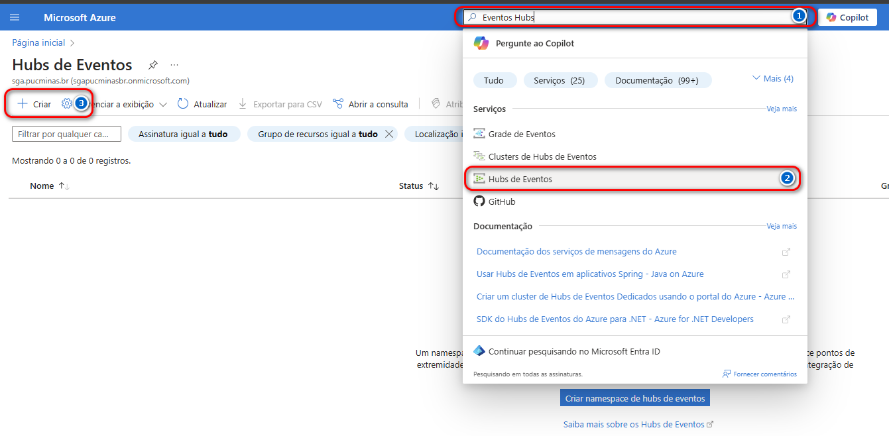
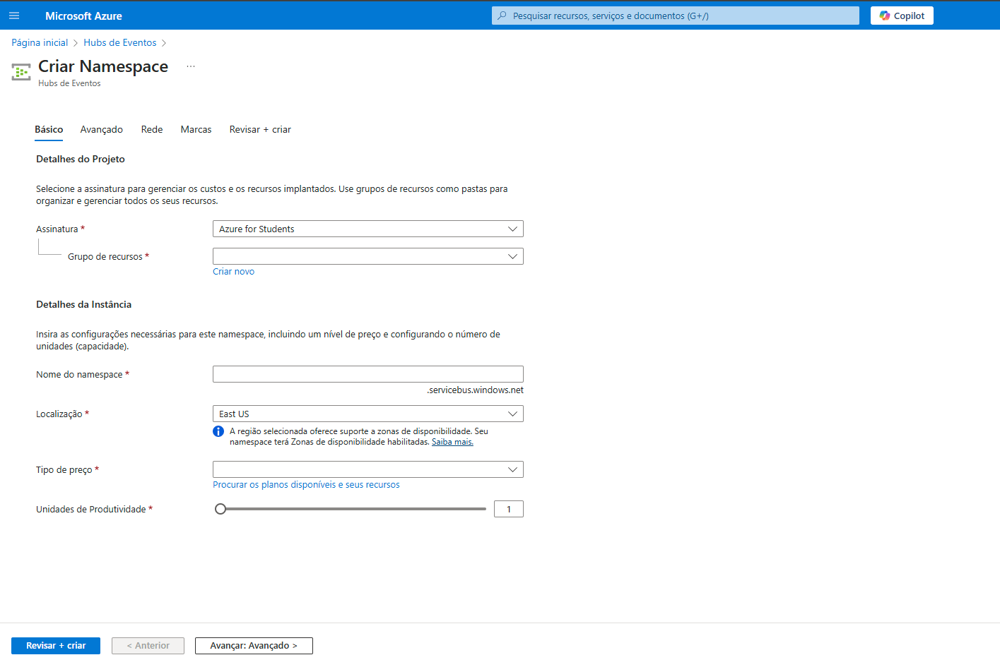
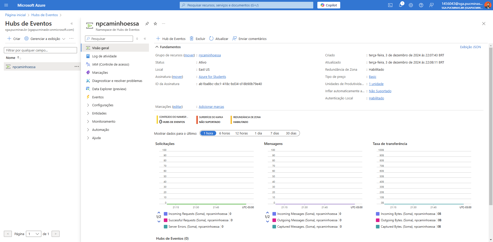
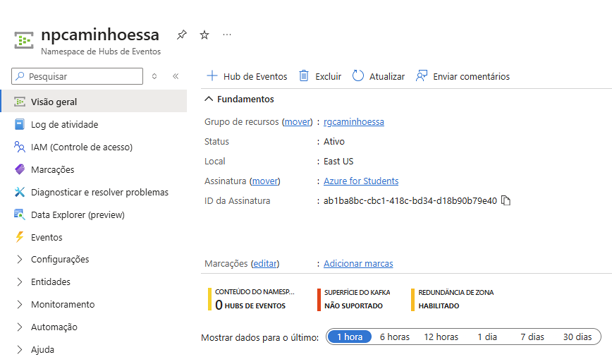
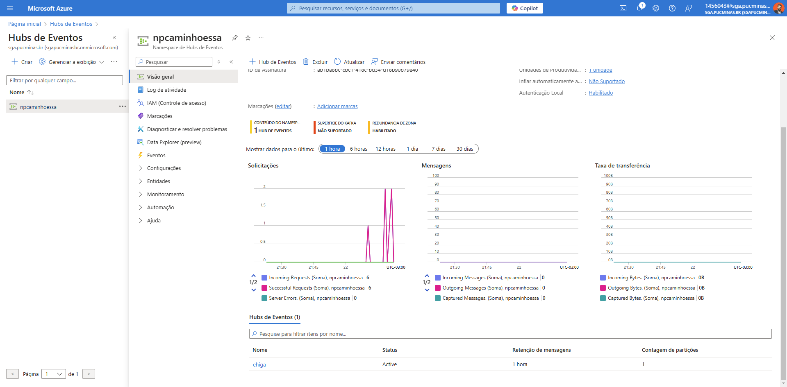

# Guia de Criação de um Event Hubs no Azure

Este guia passo a passo detalha como criar e configurar um Event Hubs no Azure para captura e processamento de eventos.

## 1. Acessando o Portal do Azure
1. No portal do Azure, pesquise por **Hubs de Eventos** na barra de pesquisa superior.
2. Clique na opção **Hubs de Eventos** para abrir o painel.



## 2. Criando um Namespace
1. No painel de **Hubs de Eventos**, clique em **Criar**.
2. Preencha os campos:
   - **Assinatura**: Escolha sua assinatura (ex.: Azure for Students).
   - **Grupo de recursos**: Clique em **Criar novo** ou selecione um existente.
   - **Nome do namespace**: Insira um nome exclusivo.
   - **Localização**: Escolha a região adequada (ex.: East US).
   - **Tipo de preço**: Escolha **Basic**.
   - **Unidades de Produtividade**: Configure como **1**.
3. Clique em **Revisar + criar** e, em seguida, em **Criar**.



### Validação da Criação do Namespace
Após a validação, o namespace será criado com as informações especificadas.



## 3. Criando um Hub de Eventos
1. Dentro do namespace criado, selecione a opção **Hubs de Eventos**.
2. Clique em **Criar** e configure:
   - **Nome**: Insira o nome do hub de eventos.
   - **Contagem de Partições**: Configure como **1**.
   - **Política de Limpeza**: Escolha **Excluir**.
   - **Tempo de Retenção (horas)**: Configure como **1**.
3. Clique em **Revisar + criar** e, em seguida, em **Criar**.



### Validação da Criação do Hub de Eventos
Após a validação, o hub de eventos estará ativo.



## 4. Configurando Políticas de Acesso Compartilhado
1. No namespace, selecione **Políticas de acesso compartilhado**.
2. Clique em **RootManageSharedAccessKey** para visualizar as configurações de chaves de acesso.
3. Copie as chaves primárias ou secundárias para uso posterior.


## 5. Configurando o Namespace no Python
1. Utilize as credenciais obtidas nas políticas de acesso para configurar sua aplicação Python.
2. Crie um arquivo `.env` na raiz do seu projeto para armazenar as informações sensíveis, como:
   ```env
   CONNECTION_STR=seu_endpoint
   EVENT_HUB_NAME=nome_do_event_hub
   ```
3. Instale as dependências necessárias:
   ```bash
   pip install azure-eventhub python-dotenv
   ```

4. Exemplo de código Python para enviar mensagens ao Event Hub:

   ```python
   from azure.eventhub import EventHubProducerClient, EventData
   from dotenv import load_dotenv
   import os

   # Carregar as variáveis do arquivo .env
   load_dotenv()

   # Informações de conexão (obtidas do .env)
   CONNECTION_STR = os.getenv('CONNECTION_STR')
   EVENT_HUB_NAME = os.getenv('EVENT_HUB_NAME')

   def send_event_to_event_hub():
       try:
           # Criar um cliente do Event Hub
           producer = EventHubProducerClient.from_connection_string(
               conn_str=CONNECTION_STR,
               eventhub_name=EVENT_HUB_NAME
           )

           # Criar um lote de eventos
           event_data_batch = producer.create_batch()

           # Adicionar eventos ao lote
           event_data_batch.add(EventData("Mensagem 1 para o Event Hub"))
           event_data_batch.add(EventData("Mensagem 2 para o Event Hub"))
           event_data_batch.add(EventData("Mensagem 3 para o Event Hub"))

           # Enviar o lote para o Event Hub
           producer.send_batch(event_data_batch)

           print("Eventos enviados com sucesso!")
       except Exception as e:
           print(f"Erro ao enviar eventos: {e}")
       finally:
           # Fechar a conexão
           producer.close()

   if __name__ == "__main__":
       send_event_to_event_hub()
   ```

## 6. Validando o Envio e Recebimento de Mensagens
Teste o envio e recebimento de mensagens para validar a configuração do Event Hubs.


## Conclusão
Você configurou com sucesso um Event Hubs no Azure. Agora é possível utilizá-lo para capturar e processar eventos em sua solução de engenharia de dados.
